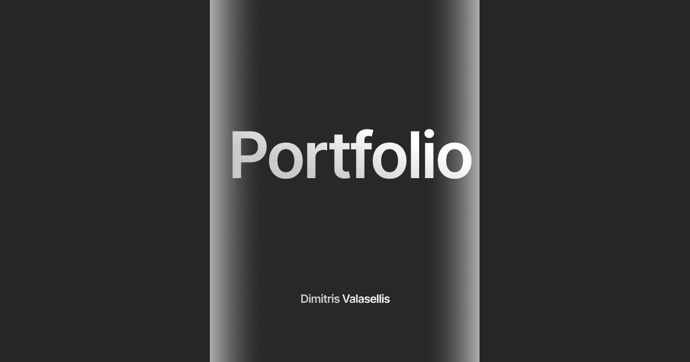

# Portfolio

<p align="center">
	
</p>

<p align="center">
	Personal portfolio showcasing my work, skills, and projects.
</p>

---

> 🚧 **Currently Being Improved**
>
> This portfolio is a personal project and is regularly updated as I add new work or refine my skills. Some features or sections may change frequently.

## Table of Contents

- [Overview](#overview)
- [Features](#features)
- [Tech Stack](#tech-stack)
- [Getting Started](#getting-started)
- [Contact](#contact)

## Overview

This is my online portfolio, built to present my main projects, technical stack, and experience as a developer. The site is responsive, visually clean, and easy to update.

## Features

- **Project Gallery** — Display of selected works and highlights.
- **Responsive Design** — Works across desktop and mobile.
- **Contact Section** — Simple way to get in touch.
- **Clean Layout** — Minimalist, content-focused, and light.

## Tech Stack

- JavaScript (41%)
- HTML (36%)
- CSS (24%)

## Getting Started

Just open `index.html` in your browser!

If you're running your own web server, simply clone the repository and serve the files as static assets:

```bash
git clone https://github.com/valasme/portfolio
